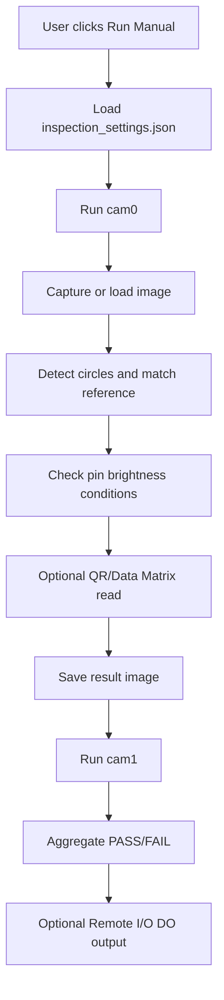
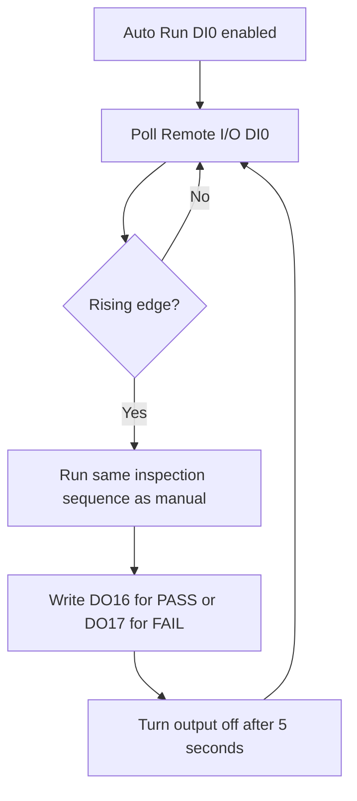

# PIN Inspection - System Design

Last reviewed: 2026-09-14

## 1. Purpose

PIN Inspection is a Python/Tkinter/OpenCV application for checking connector pin presence from two camera images. It supports:

- Manual inspection from the Use Mode screen.
- Setup/calibration per camera from the Setup Mode screen.
- Raspberry Pi camera capture through `rpicam-still` or `libcamera-still`.
- Optional QR/Data Matrix reading per camera.
- Optional Modbus TCP Remote I/O for Auto Run trigger and PASS/FAIL outputs.

## 2. Runtime Modes

The application has two main UI pages:

- Use Mode: production inspection screen. It can run manually or wait for Remote I/O DI0.
- Setup Mode: calibration screen for each camera. It detects circles, lets the user select expected pin holes, saves per-camera thresholds, and can enable or disable QR/Data Matrix reading.

System mode is controlled by `SYSTEM_MODE` in `pin_inspection_app.py`.

Recommended Raspberry Pi launch:

```bash
PIN_SYSTEM_MODE=rasp python main.py
```

Important behavior:

- `SYSTEM_MODE=window` uses `WINDOW_TEST_IMAGES` first when present.
- `SYSTEM_MODE=rasp` uses `RASP_TEST_IMAGES`; these are currently empty, so the app captures from real cameras.
- The saved `inspection_settings.json` contains a `system_mode` field, but the active runtime path is controlled by `PIN_SYSTEM_MODE` or `SYSTEM_MODE` in `pin_inspection_app.py`.

## 3. Main Components

| Component | File | Responsibility |
|---|---|---|
| App launcher | `main.py` | Starts the Tkinter app. |
| App shell | `pages/app.py` | Sidebar navigation, page lifecycle, process runner integration. |
| Setup workflow | `pages/setup_workflow.py` | Camera setup, recapture, circle detection, pin condition config, preview. |
| Use workflow | `pages/use_workflow.py` | Manual/auto inspection, sequential camera processing, result display, Remote I/O output. |
| Capture and core inspection helpers | `pin_inspection_app.py` | Camera capture, circle detection, legacy CLI setup/use flows, result image helpers. |
| Pin logic | `ck_pin.py` | Reference hole matching, pin brightness checks, visual result overlays. |
| QR/Data Matrix logic | `read_qr_code.py` | ZXing/OpenCV QR/Data Matrix decode with memory-limited preprocessing. |
| Config helpers | `pages/config.py` | Read/write `inspection_settings.json`. |
| Remote I/O client | `pages/remote_io.py` | Modbus TCP read DI and write DO coils. |
| Network config UI | `pages/network_config.py` | Configure Remote I/O IP, port, unit id, DI/DO addresses. |

## 4. Data and Configuration

Primary config file:

```text
inspection_settings.json
```

Important sections:

- `cameras.cam0` and `cameras.cam1`: circle filters, selected circle ids, expected pin holes, template reference position, brightness rules, QR enable flag.
- `remote_io`: Modbus TCP settings for DI0 trigger and DO PASS/FAIL outputs.

Current configured cameras:

- `cam0`: 1 expected pin hole, `read_qr=true`.
- `cam1`: 3 expected pin holes, `read_qr=false`.

Current Remote I/O config:

- Enabled: `true`
- Host: `192.168.11.45`
- Port: `502`
- DI0 address: `0`
- DO PASS address: `16`
- DO FAIL address: `17`

## 5. Camera Capture Design

Camera source mapping:

```python
CAMERA_SOURCES = {
    "cam0": 0,
    "cam1": 1,
}
```

Capture behavior:

- On Raspberry Pi mode, `capture_pi_image()` calls `rpicam-still` first, then falls back to `libcamera-still`.
- The image is captured to a temporary JPEG file, loaded with OpenCV, then the temporary file is deleted.
- On non-Pi/window mode, `capture_opencv_image()` uses OpenCV `VideoCapture`.

Setup page behavior:

- Entering Setup Mode does not force camera capture.
- If no last/test image exists, the UI shows: `No image for now. Please click Recapture for the setup image.`
- Recapture forces real camera capture with `use_test_image=False`.

Use page behavior:

- The app processes cameras sequentially, not in parallel, to reduce Raspberry Pi memory pressure.

## 6. Inspection Data Flow

Manual run:



Auto run:



## 7. PASS/FAIL Rules

Per camera:

- Reference circle must be found.
- Each expected pin hole must have a detected circle within its configured search radius.
- Brightness must be inside the configured min/max range.
- QR/Data Matrix reading is informational in the current Use Mode flow. If no QR is found, the code is shown as `NOT FOUND`, but the camera pin status is still driven by pin inspection.

Overall result:

- PASS only if every camera panel reports `PASS`.
- FAIL if any camera panel reports `FAIL`, cannot capture, lacks setup config, or has inspection error.

## 8. Outputs

Result images:

```text
result/
```

Use Mode creates one session folder per day. Each camera record contains the raw image, annotated result, and JSON metadata:

```text
result/
  session_YYYY-MM-DD/
    run_YYYYMMDD_HHMMSS_mmm_cam0_raw.jpg
    run_YYYYMMDD_HHMMSS_mmm_cam0_result.jpg
    run_YYYYMMDD_HHMMSS_mmm_cam0.json
```

Retention:

- Records older than 15 days are deleted.
- Total result storage is limited to 1 GB.
- When the limit is exceeded, the oldest complete record is deleted first.
- Saving and cleanup run in the inspection worker thread so the UI remains responsive.

Remote I/O outputs:

- PASS writes `DO16=true`, waits 5 seconds, then writes `DO16=false`.
- FAIL writes `DO17=true`, waits 5 seconds, then writes `DO17=false`.

## 9. Operational Considerations

- Raspberry Pi deployments should use `PIN_SYSTEM_MODE=rasp`.
- Confirm `rpicam-still` or `libcamera-still` is installed on the Pi.
- Confirm `python3-tk`, OpenCV, Pillow, NumPy, and optional `zxing-cpp` are installed.
- If the camera image does not contain QR/Data Matrix, disable `Read QR/Data Matrix for this camera` in Setup Mode to reduce processing time and memory use.
- High-resolution images can stress Pi memory; the QR reader now resizes preprocessing inputs and generates attempts lazily to reduce RAM usage.
- Remote I/O should be tested from the Configure TCP/IP dialog before production use.

## 10. Known Deployment Risks

| Risk | Impact | Mitigation |
|---|---|---|
| Wrong system mode | App loads Windows test image path or wrong capture backend. | Launch with `PIN_SYSTEM_MODE=rasp python main.py`. |
| Camera index mismatch | cam0/cam1 images swapped or capture fails. | Adjust `CAMERA_SOURCES` in `pin_inspection_app.py`. |
| No setup config | Use Mode panel fails. | Run Setup Mode and save each camera before production. |
| QR enabled on camera without code | Slower run and warning `NOT FOUND`. | Disable QR per camera if not required. |
| Remote I/O address mismatch | Wrong trigger/output behavior. | Verify DI0/DO16/DO17 addresses with the device manual and Test TCP. |
| Lighting changes | False pin fail/pass due brightness thresholds. | Recalibrate brightness ranges under production lighting. |
